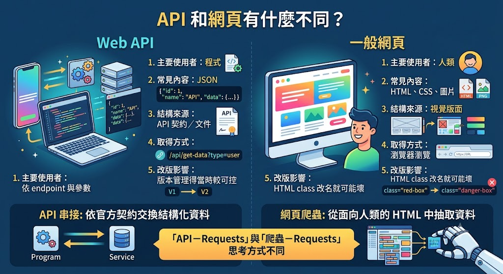
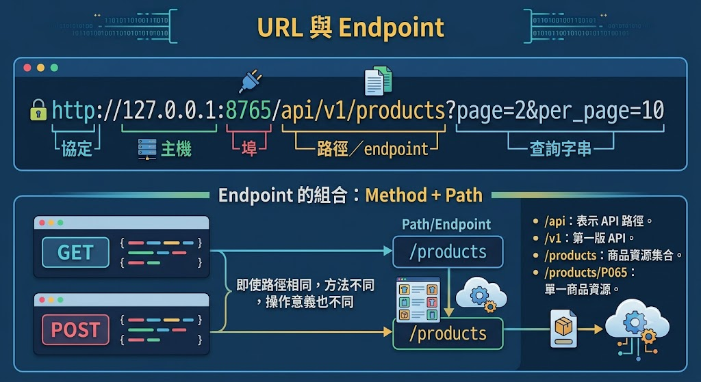
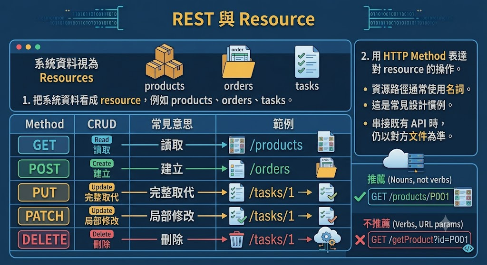
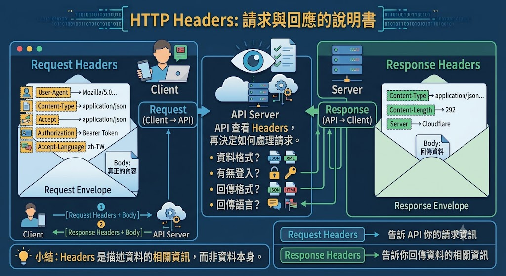

# API與Requests

==專案下載：https://github.com/kcwc1029/kcwc1029.github.io/tree/main/docs/python-notebooks/API%26Requests==

## API 到底是什麼？

- [【專有名詞】API 是什麼？｜你每天都在用，卻可能從來沒聽過？｜ 所以想知道](https://www.youtube.com/watch?v=ItT9UXCyocM)
- [API? IPA? 應用程式介面是什麼? API種類介紹 | What is API? REST? SOAP?【電腦說人話】](https://www.youtube.com/watch?v=xQULsD-r3mo&t=775s)

API 是 Application Programming Interface，中文常翻成「應用程式介面」。

用餐廳理解 API：餐廳裡：

- 你是 Client。
- 廚房是 Server。
- 菜單是 API 文件。
- 點餐窗口是 Endpoint。
- 點餐動作是 HTTP Method。
- 點餐內容是 Parameters 或 Request Body。
- 號碼牌是 Token。
- 餐點是 Response Body。
- 店員說「售完」是錯誤回應。

你不必進廚房了解每道菜如何製作，只要依菜單規則點餐。API 的價值就是把內部實作藏起來，對外提供穩定的操作方式。

## API 和網頁有什麼不同？



因此「API－Requests」與「爬蟲－Requests」雖然都使用 Requests，思考方式不同：

- API 串接：依官方契約交換結構化資料。
- 網頁爬蟲：從面向人類的 HTML 中抽取資料。

API 可以是公開服務、公司內部服務，也可以像本教材只運作於本機。重點不是「上網」，而是兩個軟體元件透過約定介面溝通。

## HTTP Request 與 Response

API 客戶端送出 Request，伺服器傳回 Response：


一個 Request 常包含：

- Method：想做什麼。
- URL：對哪個 endpoint 操作。
- Headers：格式、身分與追蹤資訊。
- Query Parameters：搜尋、分頁、排序條件。
- Body：POST、PUT、PATCH 要送出的資料。

一個 Response 常包含：

- Status Code：處理結果。
- Headers：內容格式、快取、版本等資訊。
- Body：JSON 資料或錯誤細節。

## URL 與 endpoint



## REST 與 Resource



### 補充：JSONPlaceholder

JSONPlaceholder 是一個免費提供測試用 API 的網站，專門讓開發者練習 HTTP Request、RESTful API，以及前後端串接。

簡單來說，它就像一個假的後端伺服器。你可以對它發送 GET、POST、PUT、DELETE 等請求，練習 API 操作，而不用自己架設資料庫或網站。

### 範例：第一個GET

```py
import requests

url = "https://jsonplaceholder.typicode.com/posts/1"

try:
    response = requests.get(url, timeout=5)
    response.raise_for_status()

    data = response.json()

    print("狀態碼：", response.status_code)
    print("內容類型：", response.headers.get("Content-Type"))
    print("JSON 內容：", data)
    print("文章標題：", data["title"])

except Exception as e:
    print(e)
```

`requests.get()` 回傳的是 `Response` 物件，不是 JSON dict。必須呼叫 `.json()` 才會將 Response Body 解析成 Python 物件。

| 屬性／方法                    | 用途                |
| ----------------------------- | ------------------- |
| `response.status_code`        | HTTP 狀態碼         |
| `response.headers`            | 回應標頭            |
| `response.text`               | 解碼後文字          |
| `response.content`            | 原始 bytes          |
| `response.json()`             | JSON 轉 Python 物件 |
| `response.raise_for_status()` | 4xx、5xx 時拋出例外 |
| `response.elapsed`            | 回應時間            |
| `response.request`            | 實際送出的請求      |

重要陷阱：`.json()` 成功只代表 body 是合法 JSON，不代表 API 操作成功。401、404、422、500 也可能回傳 JSON 錯誤，所以仍要檢查狀態碼。

## Query Parameters：查詢、篩選與排序

- [範例：查詢參數與商品搜尋](./API_Requests_src/查詢參數與商品搜尋.md)

Requests 會正確處理 `?`、`&`、空白、中文與特殊符號。不要手動拼接：

```python
# 不建議
url = base_url + "?category=" + category + "&q=" + keyword
```

可以印出 `response.url`，確認最後送出的網址。

```python
import requests

url = "https://jsonplaceholder.typicode.com/comments"

params = {
    "postId": 1
}

response = requests.get(url, params=params)
response.raise_for_status()

comments = response.json()

print(f"共有 {len(comments)} 筆留言\n")

for comment in comments:
    print(f"留言ID：{comment['id']}")
    print(f"姓名：{comment['name']}")
    print(f"Email：{comment['email']}")
    print("-" * 50)
```

## [Headers](./API_Requests_src/Headers與Response物件.md)

- [User-Agent 說明與使用](https://ithelp.ithome.com.tw/articles/10209356)
- [Python 爬蟲這樣學，一定是大拇指拉！ DAY24 - 實戰演練：偽裝](https://ithelp.ithome.com.tw/articles/10279630)
- [爬蟲第四步：偽裝一個headers吧！](https://quantpass.org/anti-cralwer-headers/#lwptoc2)

Headers 像包裹外面的標籤，描述資料格式、身分與處理方式：



| Header            | 常見用途               |
| ----------------- | ---------------------- |
| `Accept`          | 客戶端希望收到的格式   |
| `Content-Type`    | Request Body 的格式    |
| `Authorization`   | 認證資訊               |
| `User-Agent`      | 客戶端名稱與版本       |
| `X-Request-ID`    | 跨系統追蹤同一次請求   |
| `Idempotency-Key` | 防止建立操作被重複執行 |
| `If-None-Match`   | 搭配 ETag 做條件式請求 |

```python
headers = {
    "Accept": "application/json",
    "User-Agent": "MyCompanyOrderClient/1.0",
}
response = requests.get(url, headers=headers, timeout=5)
```

## [JSON與資料型態](./API_Requests_src/JSON與資料型態.md)

## [補充：API分頁](./API_Requests_src/API分頁.md)

## 狀態碼與錯誤模型

| 狀態碼                    | 意義                | Client 常見處理     |
| ------------------------- | ------------------- | ------------------- |
| 200 OK                    | 成功讀取／更新      | 解析 body           |
| 201 Created               | 成功建立            | 讀資料與 `Location` |
| 204 No Content            | 成功但無 body       | 不可呼叫 `.json()`  |
| 304 Not Modified          | 快取仍有效          | 沿用本機資料        |
| 400 Bad Request           | 參數或 JSON 格式錯  | 修正請求            |
| 401 Unauthorized          | 未認證或 Token 無效 | 更新認證            |
| 403 Forbidden             | 已辨識但沒有權限    | 停止或申請權限      |
| 404 Not Found             | 資源不存在          | 檢查 ID／路徑       |
| 409 Conflict              | 資源狀態衝突        | 重新讀取後處理      |
| 422 Unprocessable Content | 格式合法但驗證失敗  | 修正欄位值          |
| 429 Too Many Requests     | 超過用量            | 尊重 `Retry-After`  |
| 500 Internal Server Error | Server 非預期錯誤   | 記錄、稍後有限重試  |
| 503 Service Unavailable   | 暫時無服務          | 退避後有限重試      |

一致的錯誤 JSON 有助於 Client 處理：

```json
{
  "error": {
    "code": "VALIDATION_ERROR",
    "message": "title 不可空白"
  }
}
```

## POST

```python
"""使用 POST 建立一筆文章（JSONPlaceholder 範例）。"""

import requests

url = "https://jsonplaceholder.typicode.com/posts"

post_data = {
    "title": "Python API 教學",
    "body": "這是一篇使用 requests 建立的文章。",
    "userId": 1,
}

response = requests.post(
    url,
    json=post_data,
    timeout=5,
)

response.raise_for_status()

print("HTTP 狀態碼：", response.status_code)
print("回應內容：")
print(response.json())
```

## [基於JSONPlaceholder做CRUD示範](./API_Requests_src/基於JSONPlaceholder做CRUD示範.md)

## [補充：Cookie與Session](./API_Requests_src/Cookie與Session.md)

## [timeout與例外處理](./API_Requests_src/timeout與例外處理.md)

## API實作

- [API lists](https://publicapis.io/category/games-and-comics)
- [APIList](https://github.com/hsiangfeng/APIList)
- [public-apis](https://github.com/public-apis/public-apis)

### [實作：Dog CEO API](./API_Requests_src/Dog-CEO-API.md)

### [實作：PokéAPI](./API_Requests_src/PokéAPI.md)

### [實作：水果營養查詢Fruityvice](./API_Requests_src/水果營養查詢Fruityvice.md)

### [(喜歡)實作：iTunes_Search_API](./API_Requests_src/iTunes_Search_API.md)

### [實作：Open-Meteo](./API_Requests_src/Open-Meteo.md)

### [實作：Random User](./API_Requests_src/Random-User.md)

### [實作：TVMaze](./API_Requests_src/TVMaze.md)

### [實作：TDX運輸資料流通服務：以高雄捷運為例](./API_Requests_src/TDX運輸資料流通服務：以高雄捷運為例.md)

### [實作：基於API建立星座運勢查詢網站(其他學生做的)](./API_Requests_src/基於API建立星座運勢查詢網站.py)

### Problem

恩...這邊我有先列一些方向，我希望你可以去試著做做看API相關專題：

- 🍔 食物
- 🌤️ 天氣
- 💰 金融/幣價
- 🗺️ 地圖
- 🚆 交通

- 要做網頁，套件可以跟GPT說gradio、streamlit
- 要做桌面小程式，套件可以跟GPT說customtkinter
