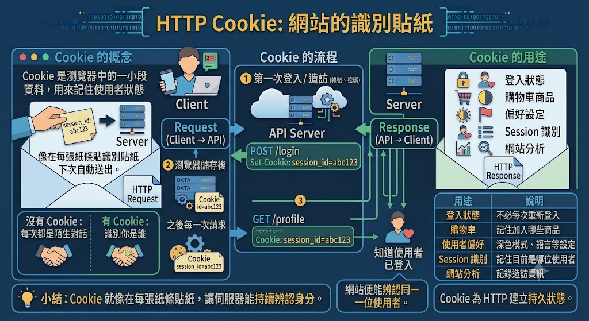
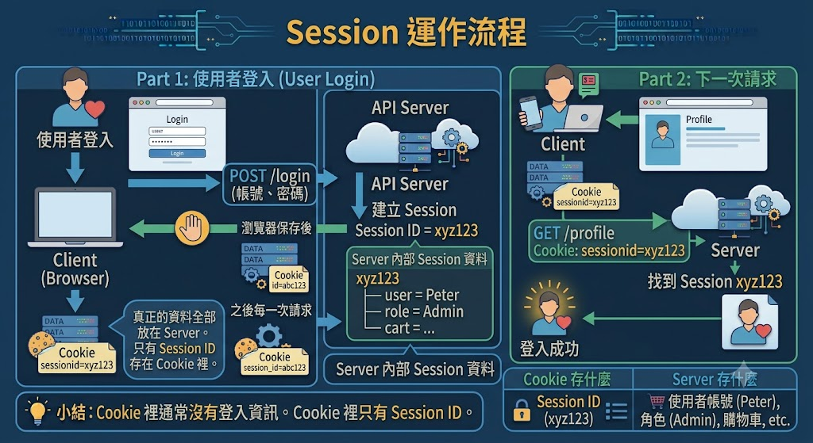

# Cookies 與 Session

- [理解 Session 和 Cookie](https://www.youtube.com/watch?v=lNQAl71Abqc&t=611s)
- [JavaScript Cookies vs Local Storage vs Session Storage](https://www.youtube.com/watch?v=GihQAC1I39Q)
- [Day14-Session與Cookie差別](https://medium.com/tsungs-blog/day14-session%E8%88%87cookie%E5%B7%AE%E5%88%A5-eb7b4035a382)

在網站開發中，HTTP 是**無狀態 (Stateless)** 的協定。

也就是說，每一次 Request 都是獨立的，伺服器並不知道：

- 這是不是同一位使用者
- 剛剛有沒有登入
- 購物車放了哪些商品

因此網站需要額外的機制來保存使用者狀態，最常見的就是 **Cookies** 與 **Session**。

# Cookies

Cookie 是**由伺服器建立，儲存在瀏覽器中的小型資料**。

當瀏覽器再次向同一個網站送出 Request 時，會自動把 Cookie 一起送回伺服器，因此網站可以辨識使用者。

常見用途：

- 自動登入
- 記住語言設定
- 深色模式
- 保存購物車
- 分析使用者行為



## Cookie 運作流程

```text
使用者
    │
    │ 第一次請求
    ▼
Server
    │
    │ 回傳 HTML
    │ Set-Cookie: user=Peter
    ▼
Browser
    │
    │ 儲存 Cookie
    ▼

之後再次請求

Browser
    │
    │ Cookie: user=Peter
    ▼
Server
```

瀏覽器會自動幫我們保存 Cookie，因此下一次 Request 不需要自己加入。

## Cookie 可以保存多久？

Cookie 分成兩種類型。

第一種，Session Cookie：沒有設定過期時間。

- 關閉瀏覽器就消失
- 最常見

第二種，Persistent Cookie：有設定有效期限。

```
例如：
- 7 天
- 30 天
- 一年
即使關閉瀏覽器仍然存在。
```

## Cookie 的優點與缺點

| 優點                         | 缺點                               |
| ---------------------------- | ---------------------------------- |
| 可以記住使用者偏好設定       | 儲存在瀏覽器，使用者可以查看內容   |
| 可實現自動登入或記住登入狀態 | 內容可能被修改或偽造               |
| 不需要每次重新輸入設定       | 不適合存放密碼或其他敏感資訊       |
| 提供個人化使用體驗           | 若管理不當，可能造成隱私與安全問題 |

# Session

Session 是**儲存在伺服器上的使用者資料**。

真正的重要資訊都放在 Server。

例如：

- 登入狀態
- 購物車
- 權限
- 使用者資料

## Session 運作流程



## Session 的優點與缺點

| 優點                               | 缺點                                  |
| ---------------------------------- | ------------------------------------- |
| 資料儲存在伺服器端，安全性較高     | 需要佔用伺服器記憶體與儲存空間        |
| 使用者無法直接修改 Session 內容    | 使用者越多，Session 管理成本越高      |
| 適合保存登入狀態、權限等敏感資訊   | Session 過期後通常需要重新登入        |
| 可集中管理使用者狀態，方便權限控制 | 分散式系統需額外處理 Session 共享問題 |

## Cookie 與 Session 的關係

很多初學者會以為：Cookie 和 Session 是二選一。其實不是，大部分網站都是：

```text
Browser
      │
Cookie
sessionid=abc123
      │
      ▼
Server
      │
Session
abc123
↓
登入資料
購物車
權限
```

也就是：**Cookie 保存 Session ID，Session 保存真正資料。**

# 在 Python 中使用 Cookie

Cookie 可以直接由 `requests` 保存。

```python
import requests

response = requests.get("https://httpbin.org/cookies/set/user/Peter")

print(response.cookies)
```

也可以自己加入 Cookie。

```python
import requests

cookies = {
    "user": "Peter"
}

response = requests.get(
    "https://httpbin.org/cookies",
    cookies=cookies
)

print(response.json())
```

# 使用 Session

如果網站需要保持登入狀態，可以使用 `requests.Session()`。

```python
import requests

session = requests.Session()

session.get("https://example.com")

response = session.get("https://example.com/profile")
```

Session 會自動：

- 保存 Cookie
- 每次 Request 自動帶上 Cookie

因此通常不需要自己管理 Cookie。

# Cookie 與 Session 的實際應用

| Cookie 適用情境                     | Session 適用情境                 |
| ----------------------------------- | -------------------------------- |
| 記住登入帳號 (Remember Me)          | 維持使用者登入狀態               |
| 保存深色模式、字體大小等個人偏好    | 網路銀行交易與身分驗證           |
| 記住網站語言 (繁體中文、English 等) | 線上購物車商品資訊               |
| 保存最近搜尋紀錄                    | 後台管理系統的權限控管           |
| 網站流量分析 (如 Google Analytics)  | 線上考試、會員中心等需驗證的功能 |

### 常見面試題

```text
### Cookie 和 Session 有什麼差別？

Cookie 儲存在瀏覽器；Session 儲存在伺服器。
```

```text
## 為什麼 Session 比較安全？

因為真正資料存在伺服器，瀏覽器通常只保存 Session ID。
```

```text
## Cookie 可以存密碼嗎？

不建議。
Cookie 屬於用戶端資料，即使有加密，也不適合直接存放密碼或其他敏感資訊。
```

```text
## Cookie 如何提高安全性？

可以搭配：
- HttpOnly
- Secure
- SameSite
降低 XSS 與 CSRF 攻擊風險。
```

```text
### Session 為什麼需要 Cookie？

因為伺服器需要知道：
> 「這是哪一位使用者？」
瀏覽器透過 Cookie 攜帶 Session ID，伺服器才能找到對應的 Session。
```

```text
## Cookie 被刪除會怎樣？
如果 Session ID 存在 Cookie 中，Cookie 被刪除後，伺服器就無法辨識使用者，通常需要重新登入。
```
