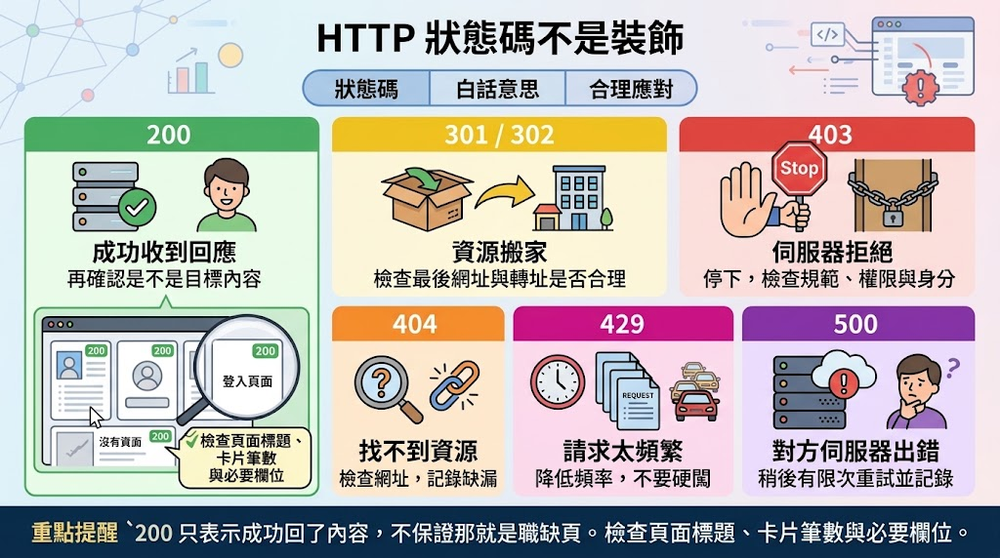

# 爬蟲介紹與 BeautifulSoup

## 🔴爬蟲到底在做什麼

假設你正在找工作。你打開職缺網站，看見 72 張職缺卡片，想知道：

- 哪些工作接受無經驗？
- 哪些工作最低薪資超過 35,000 元？
- 臺中有哪些 Python 相關職缺？
- 哪個技能在這批職缺最常出現？

人工做法是點開、複製、貼到 Excel，重複 72 次。爬蟲不是魔法，而是把這套固定動作寫成程式。英文常稱 Web Scraping；可以想成從一大張公開佈告欄上，把需要的欄位整理進自己的表格。

爬蟲很適合「規則相同、筆數很多、需要重複」的任務；若只有三筆或每頁都要人類判斷，寫程式未必划算。

- [GPT：爬蟲時代轉變](https://chatgpt.com/share/6a8919c2-2650-83e8-ae52-beb1d74e01c6)

## 🔴先讀懂 HTML

### HTML 是有結構的文字

```html
<article class="product" data-id="P001">
  <h2 class="name">炙燒雞腿便當</h2>
  <span class="price">120</span>
  <a href="/food/P001">查看餐點</a>
</article>
```

- Tag（標籤）：`article`、`h2`、`span`、`a`，說明內容角色。
- Attribute（屬性）：`class`、`data-id`、`href`，提供附加資訊。
- Text（文字）：使用者真正看到的「炙燒雞腿便當」。
- Nesting（巢狀）：標籤可以包住其他標籤。

`<article ...>` 是開始標籤，`</article>` 是結束標籤。瀏覽器即使遇到不完美 HTML 也常努力修正；解析器不同時，修正結果可能略有不同，因此專案應固定解析器。

### DOM 是一棵家族樹

```text
article.product
├── h2.name
│   └── 炙燒雞腿便當
├── span.price
│   └── 120
└── a
    └── 查看餐點
```

`article` 是三個標籤的 parent；`h2`、`span`、`a` 是 children，三者互為 siblings。理解樹很重要，因為可靠做法是「先找到每張卡，再在同一張卡中找名稱、公司、薪資」，不應從整頁各抓一份名稱清單與薪資清單。若其中一張缺薪資，兩份清單會錯位，A 職缺可能配到 B 的薪資。

### id 與 class

可以把 `id` 想成學號：一頁理論上唯一；`class` 想成社團：許多元素都能加入。同一元素也能有多個 class：

```html
<h1 id="site-title">轉職雷達</h1>
<article class="job-card remote">...</article>
```

## 🔴網站像一間餐廳


Requests 像「取貨」，BeautifulSoup 像「拆箱分類」。BeautifulSoup 本身不會上網；把 HTML 字串交給它，它才知道怎麼整理。

## 🔴HTTP狀態碼不是裝飾



`200` 只表示伺服器成功回了一份內容，不保證那就是職缺頁；登入頁、驗證頁和「查無資料」頁也能是 200。因此還要檢查頁面標題、卡片筆數與必要欄位。

## 🔴靜態網站 vs 動態網站

學爬蟲時，很常遇到一個情況：你明明用瀏覽器看得到商品、新聞或職缺，但使用 `requests` 抓取後，卻找不到那些資料。這通常不是 BeautifulSoup 寫錯，而是網站載入資料的方式不同。

網站可以先簡單分成兩種：

- 靜態網站：伺服器回傳的 HTML 裡，已經包含我們要的資料。
- 動態網站：瀏覽器收到頁面後，再透過 JavaScript、API 等方式取得資料並更新畫面。

### 靜態網站

假設你打開一個商品網站，伺服器直接回傳：

```html
<!-- 商品名稱與價格已經存在 HTML 裡。 -->
<div class="product">
  <h2>無線滑鼠</h2>
  <span class="price">590</span>
</div>
```

這時候流程很單純：

```text
你的程式
   ↓
requests 發送請求
   ↓
網站回傳 HTML
   ↓
HTML 已經包含商品資料
   ↓
BeautifulSoup 解析 HTML
   ↓
取得商品名稱、價格
```

因此這類網站通常可以直接使用requests + BeautifulSoup做爬蟲。

### 動態網站

另一種情況是，伺服器一開始只回傳基本頁面：

```html
<div id="product-list"></div>
<!-- HTML 裡根本沒有商品 -->
```

瀏覽器開啟頁面後，JavaScript 才繼續向網站取得商品資料：

```text
瀏覽器開啟網站
   ↓
取得基本 HTML
   ↓
執行 JavaScript
   ↓
向 API 取得商品資料
   ↓
JavaScript 將資料放進網頁
   ↓
使用者看到完整商品列表
```

這就要靠API、Selenium等方式去處理(後續在講)。

## 🔴BeautifulSoup 核心操作

### 🟡[find 與 find_all](./Scraping&BeautifulSoup_src/find與find_all.py)

```python
title = soup.find("h1")
cards = soup.find_all("article", class_="product")
```

| 方法         | 回傳                 | 找不到 | 適用                 |
| ------------ | -------------------- | ------ | -------------------- |
| `find()`     | 第一個 Tag           | `None` | 單一標題、第一個連結 |
| `find_all()` | 類似清單的 ResultSet | 空集合 | 多張卡、多個連結     |

因為 `class` 是 Python 保留字，所以 BeautifulSoup 使用 `class_`。

```python
title = soup.find("h9")
if title is None:
    print("找不到標題，請檢查 HTML 或條件")
else:
    print(title.get_text(strip=True))
```

### 🟡[取得文字與屬性](./Scraping&BeautifulSoup_src/取得文字與屬性.py)

```python
name = tag.get_text(" ", strip=True)
job_id = card["data-job-id"]
href = link.get("href", "")
```

- `get_text(" ", strip=True)` 收集內部文字、以空格連接並清除頭尾空白。
- `tag["href"]` 在屬性不存在時拋錯，適合不可缺的欄位。
- `tag.get("href", "")` 找不到時給預設值，適合可選欄位。

不要所有欄位都默默給空字串。必要欄位若消失，程式應明確失敗；不然網站整頁改版，程式可能輸出 72 筆空白還宣稱成功。

### 🟡[CSS選擇器](./Scraping&BeautifulSoup_src/CSS選擇器.py)

如何找CSS Selector：

```text
→ Elements
→ Ctrl + F
→ 搜尋頁面上的文字
→ 找到附近 HTML
→ 觀察 class / id / tag
→ 自己寫 Selector
```

```python
soup.select("article.job-card")        # 所有職缺卡
soup.select_one("#site-title")         # id=site-title 的第一個元素
soup.select(".job-card .salary")       # 卡片內任意層的 salary
soup.select("article.remote")          # article 且具有 remote class
soup.select("[data-job-id='J009']")    # 指定屬性值
soup.select(".product:not(.sold-out)") # 排除售完商品
```

| 寫法           | 意思             |
| -------------- | ---------------- |
| `tag`          | 標籤名           |
| `.class`       | class 名稱       |
| `#id`          | id 名稱          |
| `A B`          | A 裡任意深度的 B |
| `A > B`        | A 的直接子元素 B |
| `[attr]`       | 具有某屬性       |
| `[attr=value]` | 屬性值符合       |
| `:not(...)`    | 排除條件         |

請從右往左讀 `section#job-list article.job-card h2.job-title`：「找 class 是 job-title 的 h2；它位於 job-card 文章裡；文章位於 id 是 job-list 的區段裡。」

過短的 `.name` 可能連使用者名稱都抓到；過長的 `body > main > div:nth-child(2)...` 插入廣告就壞。`article.job-card .job-title` 通常較能表達資料語意。

### select()、select_one()、find() 到底該選哪個

| 想做的事                  | 建議                    |
| ------------------------- | ----------------------- |
| 找一個元素                | `select_one()`          |
| 找很多元素                | `select()`              |
| 條件很簡單                | `find()` / `find_all()` |
| class、階層、屬性混合條件 | CSS Selector            |

## 🔴lxml

當我們使用 requests 抓取網站時：

```py
response = requests.get(url)
```

取得的網頁內容其實是一大串 HTML 文字：

```html
<html>
  <body>
    <h1>BeautifulSoup 教學</h1>
    <p>今天學習網路爬蟲</p>
  </body>
</html>
```

BeautifulSoup 需要先把這些 HTML 文字解析成有結構的資料，之後我們才能使用 select()、select_one()、find() 等方法尋找內容。這個「解析 HTML」的工作，就需要解析器(Parser)。而lxml是幫 BeautifulSoup 看懂 HTML 的解析器。

可以把整個流程想成：網站 => requests 取得 HTML => lxml 解析 HTML => BeautifulSoup 建立資料結構 => select()、select_one() 尋找資料。

### lxml 不是唯一的解析器

BeautifulSoup 也可以使用 Python 內建的 html.parser：

soup = BeautifulSoup(response.text, "html.parser")

兩者最大的差別可以先簡單記成：

| 解析器        | 特點                   | 是否需要額外安裝 |
| ------------- | ---------------------- | ---------------- |
| `html.parser` | Python 內建，方便使用  | 不需要           |
| `lxml`        | 速度快，常用於網頁爬蟲 | 需要             |

## 🟢範例

- [中文Wikipedia爬蟲：以蔡阿嘎為例](./Scraping&BeautifulSoup_src/中文Wikipedia爬蟲：以蔡阿嘎為例.py)
- [中文Wikipedia爬蟲：添加搜尋](./Scraping&BeautifulSoup_src/中文Wikipedia爬蟲：添加搜尋.py)
- [台灣銀行牌告匯率爬蟲](./Scraping&BeautifulSoup_src/台灣銀行牌告匯率爬蟲.py)
  - [GPT：比較Headers設定](https://chatgpt.com/share/6a894619-907c-83e8-b738-a9468dad13ca)
- [行政院本院新聞爬蟲：抓取新聞列表](./Scraping&BeautifulSoup_src/行政院本院新聞爬蟲：抓取新聞列表.py)
- [行政院本院新聞爬蟲：進入詳細頁抓完整內文](./Scraping&BeautifulSoup_src/行政院本院新聞爬蟲：進入詳細頁抓完整內文.py)
- [行政院本院新聞爬蟲：使用分頁抓多頁新聞](./Scraping&BeautifulSoup_src/行政院本院新聞爬蟲：使用分頁抓多頁新聞.md)
- [博客來爬蟲：以中文書暢銷榜為例](./Scraping&BeautifulSoup_src/博客來爬蟲：以中文書暢銷榜為例.py)

## 🔴爬蟲可以用的GPT提示詞

```text
你是一位熟悉 Python、requests、BeautifulSoup、網站 API 與瀏覽器開發者工具的爬蟲工程師。
我會提供一個網站網址，請你實際分析該網站的資料來源、HTML 結構與抓取難度，不要只根據網站外觀猜測。
我的程度是 Python 與 BeautifulSoup 初學者。請優先提供容易閱讀、適合教學、可以直接執行的方法。

網站網址：【把網址貼在這裡】

請依照以下格式回答：

## 網站爬取評估
請檢查並說明：
- requests 能否正常取得網頁
- 主要資料是否存在於 HTML 原始碼
- 資料是否由 JavaScript 動態載入
- 是否需要登入、Cookie、Token 或驗證碼
- 是否有反爬蟲機制
- 是否有分頁、無限捲動或「載入更多」
- 是否有官方 API、內部 API、JSON、RSS 或 CSV 可以使用
- 是否需要留意 robots.txt、網站條款、個人資料或著作權

請評定難度：
- 難度 1：適合 BeautifulSoup 初學者
- 難度 2：需要處理分頁或詳細頁
- 難度 3：需要尋找 API 或解析 JSON
- 難度 4：需要 Cookie、Token、Selenium 或 Playwright
- 難度 5：反爬蟲嚴格、需要登入或驗證，不適合初學者

## 建議使用的方法
請從以下方法選擇最適合的一種：
- requests + BeautifulSoup
- 直接呼叫 API
- Selenium
- Playwright
- 其他方法
- 不建議爬取
不要模糊地同時推薦所有方法。
如果網站有 API，請優先比較 API 與 BeautifulSoup，說明哪個方法比較穩定、簡單。

## 判斷依據
請列出實際觀察到的依據：
- HTTP 狀態碼
- Content-Type
- HTML 中是否有目標資料
- 重要的 HTML 標籤、class 或 id
- script 中是否出現 API 網址
- JSON 資料來源
- 分頁網址或分頁參數
- 是否出現 403、429、驗證碼或登入畫面
如果無法實際開啟網站、檢查原始碼或查看 Network，請清楚說明。
不可以虛構 HTML 結構、CSS Selector、API 網址或 JSON 欄位。

## 可以取得的資料
請用條列方式列出可以取得的資訊。
每個欄位請包含：
- 中文欄位名稱
- 網頁上的資料範例
- CSS Selector、JSON 欄位或資料位置
- 資料來自列表頁或詳細頁
- 是否可能出現空值
例如：
- 商品名稱：`.product-title`
- 商品價格：`.price`
- 商品網址：`a.product-link` 的 `href`
- 商品圖片：`img` 的 `src` 或 `data-src`
- 商品介紹：需要進入詳細頁取得
如果 Selector 尚未驗證，請標示「需要使用開發者工具確認」，不要自行猜測。

## 抓取流程
請用簡單步驟說明程式如何運作，例如：
1. 取得列表頁
2. 找到每一筆資料
3. 取得標題與連結
4. 使用 urljoin() 組合完整網址
5. 進入詳細頁抓取內容
6. 處理下一頁
7. 整理成 pandas DataFrame
8. 儲存成 CSV
請一併說明哪些地方最容易抓不到資料。

## 完整程式碼
請根據網站實際結構，提供一份可以直接執行的完整 Python 程式碼。
如果適合使用 BeautifulSoup，請優先使用：
- requests
- BeautifulSoup
- pandas
- urljoin
- requests.Session()
- lxml

程式碼需要包含：
- 網址設定
- 合理的 headers
- timeout
- raise_for_status()
- HTML 解析
- 經過驗證的 CSS Selector
- 空值判斷
- 相對網址轉成完整網址
- 分頁處理(網站有分頁時)
- 詳細頁處理(需要時)
- try-except 錯誤處理
- 適度使用 time.sleep()
- 建立 pandas DataFrame
- 顯示前幾筆資料
- 儲存成 UTF-8-SIG 編碼的 CSV
- 顯示取得的資料筆數

程式碼請使用適合初學者閱讀的寫法。變數名稱要清楚，不要把所有邏輯壓縮成一行。

請使用以下註解風格：

response = session.get(
    url,
    timeout=10
) # 發送 HTTP GET 請求，最多等待 10 秒

response.raise_for_status() # 如果發生 4xx 或 5xx，直接拋出例外

每個主要區塊使用以下格式：

### 設定網址
### 建立 Session
### 發送 HTTP 請求
### 解析 HTML
### 抓取資料
### 建立 DataFrame
### 儲存 CSV

如果網站適合使用 API，請改成提供完整的 API 抓取程式碼，並說明：
- API 網址
- 請求方法
- 查詢參數
- 是否需要 headers、Cookie 或 Token
- JSON 資料結構
- 如何處理分頁
- 如何取出需要的欄位
- API 是官方公開 API，還是網站內部 API

如果需要 Selenium 或 Playwright，請先說明 BeautifulSoup 無法使用的具體原因，再提供最精簡、可以執行的版本。

## 程式碼說明
請說明：
- 每個主要程式區塊的作用
- 可以修改的抓取頁數
- 可以修改的等待秒數
- CSV 檔名
- 可能失效的 CSS Selector 或 API 參數

## 執行失敗時如何檢查
如果程式執行後取得 0 筆資料，請告訴我應該依序檢查哪些地方。
不要只提供通用範例。程式碼必須針對我提供的網站撰寫。
如果目前沒有足夠資訊寫出可靠的 Selector 或 API 請求，請告訴我如何從瀏覽器開發者工具取得所需的 HTML 或 Network 資訊。
不可以在資料不足時假裝程式能正常執行。
```

### Problem. [基於BeautifulSoup對Quotes_to_Scrape爬蟲](./Scraping&BeautifulSoup_HW/基於BeautifulSoup對Quotes_to_Scrape爬蟲.md)

### Problem. [基於BeautifulSoup對Quotes_to_Scrape自動翻頁](./Scraping&BeautifulSoup_HW/基於BeautifulSoup對Quotes_to_Scrape自動翻頁.md)

### Problem. [基於BeautifulSoup對Scrape_This_Site爬蟲](./Scraping&BeautifulSoup_HW/基於BeautifulSoup對Scrape_This_Site爬蟲.md)

### Problem. [基於BeautifulSoup對Books_to_Scrape爬蟲](./Scraping&BeautifulSoup_HW/基於BeautifulSoup對Books_to_Scrape爬蟲.md)

### Problem. [基於BeautifulSoup對PTT_Stock文章列表爬蟲](./Scraping&BeautifulSoup_HW/基於BeautifulSoup對PTT_Stock文章列表爬蟲.md)
